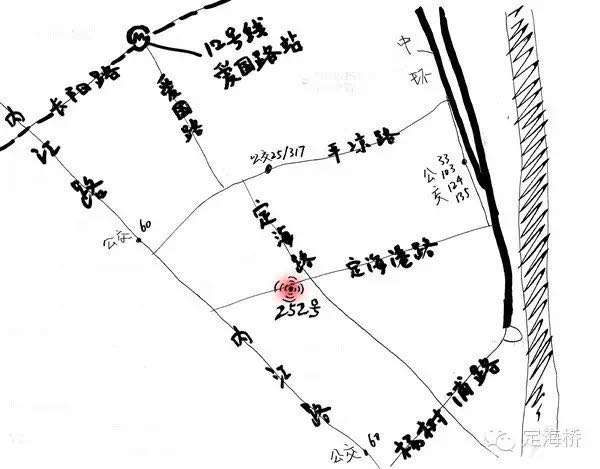

# 定海桥互助社
定海桥互助社地处历史性的工人社区之中，现在，移居人口为这里注入了新活力。互助社是一个自发组织，也是用于社员共同学习、会谈、待客、反思、组织、创作的活动现场。通过对集结与创造艺术/知识之方法的探索，互助社意在促成邻里或同志之间在互惠的原则下互动、互助、合作。互助社会举办讲座、游览、出版、地方特色的晚餐、学者驻地、放映活动和城际交换等项目和活动。

**地址**：上海市杨浦区定海港路252号

**邮箱**：dinghaiqiao@yeah.net

欢迎关注我们的**微信公众号**

Dinghaiqiao Mutual Aid Society, located in a historical working-class neighbourhood with a new and vibrant migrant population in Shanghai, is a self-organised group and physical place for learning, proposing, inviting, reflecting, organising and creatively working together. By exploring ways of gathering and producing art/knowledge, it pursues interaction, assistance, and cooperation with neighbours and comrades under the principle of reciprocity. Its programs include talks, guided tours, publications, locally cooked dinners, knowledge residencies, screenings, and inter-city exchanges.

Our address: No. 252, Dinghaigang Rd., Yangpu District, Shanghai

E-mail: dinghaiqiao@yeah.net
